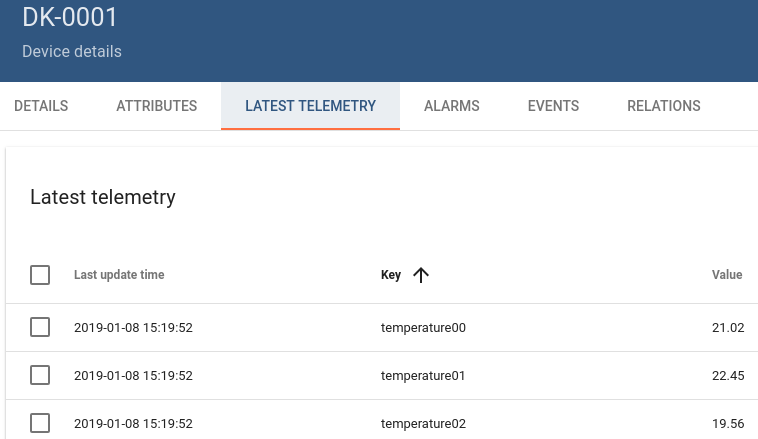

This example sends periodically the values of the temperature sensors to our
[ThingsBoard](https://data.esys.eu).

# How to run it

## Upload it to the device

```bash
$ DEVICE_IP=192.168.0.14
$ cd ../
$ scp -r 01* pi@${DEVICE_IP}:/home/pi/
```

## Run it over SSH

```bash
$ ssh pi@${DEVICE_IP}
password: raspberry
$ cd 01*
$ sudo ./main.py aBcDeFgHiJkLmNoPqRsT
Sending {
  "temperature00": "21.02",
  "temperature01": "22.45",
  "temperature02": "19.56",
  "temperature03": "20.67",
  "temperature04": "21.12",
  "temperature05": "21.32",
  "temperature06": "19.54",
  "temperature07": "18.01",
  "temperature08": "14.11",
  "temperature09": "25.58",
  "temperature10": "21.66",
  "temperature11": "21.98"
} over MQTT...
[...]
```

> **NOTE**: replace `aBcDeFgHiJkLmNoPqRsT` with a ThingsBoard gateway token.

## Check that the data arrive in ThingsBoard



# How it works

This example performs the following steps periodically:

* Select the SPI slave containing the temperature sensors.
* As an SPI master query all temperatures.
* Put the temperature in a JSON structure to be sent via [MQTT](http://mqtt.org/).
* Establish an MQTT connection to our ThingsBoard.
* Publish the data.
