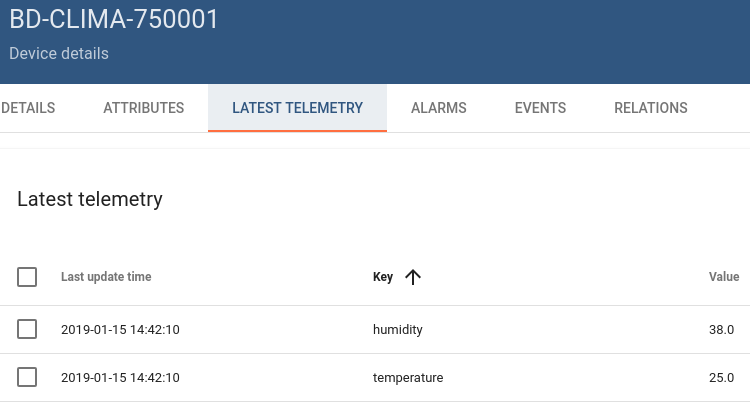

This example sends the temperature and humidity delivered by a
[blueDAN clima](https://www.esys.eu/product/bluetooth-climate-logger-bluedan-clima_4-0.html) to our
[ThingsBoard](https://data.esys.eu).

# How to run it

## Upload it to the device

```bash
$ DEVICE_IP=192.168.0.14
$ cd ../
$ scp -r 05* pi@${DEVICE_IP}:/home/pi/
```

## Run it over SSH

```bash
$ ssh pi@${DEVICE_IP}
password: raspberry
$ cd 05*
$ ./main.py aBcDeFgHiJkLmNoPqRsT
Scanning for blueDAN clima devices...
Found blueDAN clima device ec:fa:c1:04:f0:50 / 750001
Connecting...
Connected.
Sending {
  "humidity": "38.0",
  "temperature": "25.0"
} over MQTT...
[...]
```

> **NOTE**: replace `aBcDeFgHiJkLmNoPqRsT` with a ThingsBoard gateway token.

## Check that the data arrive in ThingsBoard



# How it works

This example performs the following steps periodically:

* Scan for Bluetooth devices.
* Connect to the first blueDAN clima device found.
* Ask the device to perform a new measurement.
* Read the measurement.
* Put the measurement in a JSON structure to be sent via [MQTT](http://mqtt.org/).
* Establish an MQTT connection to our ThingsBoard.
* Publish the data.
